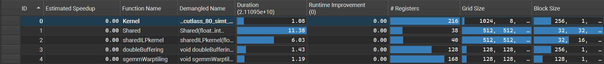

# NVIDIA_GEMM
   


# Final results
Matrix size:
16384*16384

| Kernel   | Description | Duration | Kernel/CUBLAS（%） |
| ---------- | ----------------------- | -------- | ------------------------ |
| CUBLAS     | Official library function| 1.08 | 100.000000 |
| Shared     | Shared Memory(each thread compute one element)| 11.38 | 9.490333 |
| SharedILPkernel | Shared Memory(each thread compute two elements)| 6.03 | 17.910447 |
| DoubleBuffering | Double Buffer | 1.43 | 75.524475 |
| SgemmWarptiling | Warp tile | 1.19 | 90.756302 |




# Compile
```
nvcc -O3 --use_fast_math -lineinfo -Xptxas -v -arch=sm_86 kernel.cu -o kernel.exe -lcublas
```


# Run with NVIDIA Nsight Compute in Powershell
```
ncu --nvtx --replay-mode application --export profile_report --section ComputeWorkloadAnalysis --section MemoryWorkloadAnalysis  --section MemoryWorkloadAnalysis_Chart --section MemoryWorkloadAnalysis_Tables ./kernel.exe | Tee-Object -FilePath log.txt
```